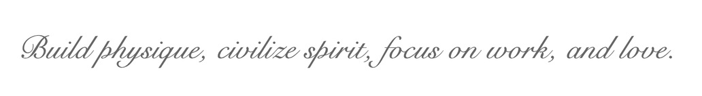

<!-- 

 -->
<!-- 
 -->

## Hi there, I'm [Levon Dang](https://github.com/Droliven) 👋

<!--  -->

  
###  A little more about me...  

- Received the **M.E. degree** from [**South China University of Technology**](https://www.scut.edu.cn/en/) in 2023.06, major in computer technology.
- Worked as an **intern** in TEG, [**Tencent AI Platform Department** ](https://ai.tencent.com/ailab/en/index/), during 2022.05.17-2022.07.12.
- Received my **Bachelor's degree** from [**Shanghai University**](https://en.shu.edu.cn/) in 2020.06, majored in computer science and technology.
- 🔭 Reaserch interests are
	1. [**Deterministic Human Motion Prediction**](https://github.com/Droliven/MSRGCN)
	1. [**Stochastic Human Motion Generation / Diversity Promotion or Diverse Sampling for Generative Networls**](https://github.com/Droliven/diverse_sampling)
	1. [3D Human Pose & Shape Reconstruction / Mesh Recovery](https://github.com/Droliven/pymaf_reimplementation).
- Some other areas or techniques that I have been exposed to but not that familiar with: Pose Estimation, Image Inpainting, Anomaly Detection, Face Swapping, Meta Learning, Semisupervised / Unsupervised Learning, Quantitative Finance, *etc.*
- 💬 Talk with me about anything [levondang@163.com](mailto:levondang@163.com)

<!-- ### Motto

  -->

---

### Papers

#### 2023

<ul style="padding-left:12px;">
    <li>
    	

		<b><a href="https://github.com/Droliven">Lingwei Dang</a></b> 
		确定性和多样性人体动作预测方法研究 (Research on Deterministic and Diverse Human Motion Prediction Methods) 
		Dissertation for the Master of Engineering Degree, SCUT, Guangzhou, China, Jun 04, 2023.  
<!-- 		Accepted papers 690, acceptance rate <b>27.9%</b> 	  -->
		<a href="https://www.cnki.net/">[Paper in CNKI] coming soon ...</a> <a href="https://www.cnki.net/">[PPT] coming soon ...</a>
     	

   </li>
</ul>

#### 2022

<ul style="padding-left:12px;">
    <li>
    	

		<b><a href="https://github.com/Droliven">Lingwei Dang</a></b>, <a href="https://nieyongwei.net">Yongwei Nie</a>*, <a href="http://www.chengjianglong.com">Chengjiang Long</a>, <a href="http://zhangqing-home.net/">Qing Zhang</a>, <a href="http://www2.scut.edu.cn/cs/2017/0629/c22284a328097/page.htm">Guiqing Li</a> 
		Diverse Human Motion Prediction via Gumbel-Softmax Sampling from an Auxiliary Space 
		Proceedings of the 30th ACM International Conference on Multimedia (<b>ACM MM</b>), Lisbon, Portugal, Oct 10-14, 2022.		  
	Accepted papers 690, acceptance rate <b>27.9%</b> 	 
		<a href="https://github.com/Droliven/diverse_sampling">[Project]</a> <a href="https://arxiv.org/abs/2207.07351">[Paper]</a> <a href="https://github.com/Droliven/diverse_sampling">[Pytorch code]</a>  <a href="https://github.com/Droliven/DHMP_jittor">[Jittor code]</a> 
     	

   </li>
	<li>
    	

		<a href="mailto:201704432@stu.ncwu.edu.cn">Zhixiang Song</a>*, <b><a href="https://github.com/Droliven">Lingwei Dang</a></b> 
		Library Personalized Service System Based on Computer Network Technology 
		Security and Communication Networks, 2022.  
		<a href="https://www.hindawi.com/journals/scn/2022/2550820/">[Paper]</a>
     	

   </li>
	<li>
    	

		<a href="https://yansun-shu.github.io/">Yan Sun</a>*, <b><a href="https://github.com/Droliven">Lingwei Dang</a></b> 
		A Fine Three-dimensional Adaptive Color Segmentation Algorithm for Real-time Vision System of Soccer Robot 
		Proceedings of the 4th International Conference on Communications, Information System and Computer Engineering (<b>CISCE</b>), Shenzhen, China, Jun 24-26, 2022.		  
		<a href="https://ieeexplore.ieee.org/author/37089489036">[Paper]</a>
     	

   </li>
  </ul>

#### 2021

<ul style="padding-left:12px;">
	<li>
    	

		<b><a href="https://github.com/Droliven">Lingwei Dang</a></b>, <a href="https://nieyongwei.net">Yongwei Nie</a>*, <a href="http://www.chengjianglong.com">Chengjiang Long</a>, <a href="http://zhangqing-home.net/">Qing Zhang</a>, <a href="http://www2.scut.edu.cn/cs/2017/0629/c22284a328097/page.htm">Guiqing Li</a> 
		MSR-GCN: Multi-Scale Residual Graph Convolution Networks for Human Motion Prediction 
		Proceedings of the IEEE International Conference on Computer Vision (<b>ICCV</b>), Montreal, Canada, Oct 11-17, 2021.  
		Accepted papers 1617, acceptance rate <b>25.9%</b> 	
<a href="https://github.com/Droliven/MSRGCN">[Project]</a><a href="https://arxiv.org/abs/2108.07152">[Paper]</a> <a href="https://github.com/Droliven/MSRGCN">[Code]</a>

	

   </li>
  </ul>
  
  
  ---
  
 ### Honors and Awards
 
+ Guangdong-plus Empowerment Scholarship (粤+赋能奖学金，2022.)**\[1\]**
+ Excellent Communist Party Member (优秀共产党员，2022.06)
+ Polar 3D Special Scholarship for Graphics and Images (极点三维图形图像专项奖学金，2021.10)**\[2\]**
+ Excellent individual (优秀个人，2019.05)
+ National Encouragement Scholarship (国家励志奖学金，2018.11.20)
+ Excellent individual (优秀个人，2018.05)
+ National Encouragement Scholarship (国家励志奖学金，2017.12.20)
+ First Class Scholarship (学业一等奖学金，2017.11.30)

\[1\] Supported by Guangdong Youxin Public Welfare Foundation & 37 Interactive Entertainment Network Technology Group Co., Ltd. （由广东省游心公益 · 三七互娱提供）

\[2\] Supported by Suofeiya Home Collection Co., Ltd. & Guangzhou Polar 3D Information Technology Co., Ltd. （由索菲亚 · 极点三维提供）
 
 ---

### Languages and Tools

<code></code>
<code></code>
<code></code>
<code></code>
<code></code>
<code></code>
<code></code>
<code></code>
<code></code>
<code></code>
<code></code>
<code></code>
<code></code>
<code></code>
<code></code>
<code></code>
<code></code>
<code></code>

---

### Activity analysis

  
  
<!--    -->
  

&nbsp;
&nbsp;

 

---

<!-- ### Reference

+ [海拥wanghao221](https://github.com/wanghao221/wanghao221)
+ [Github 展示](https://cdmana.com/2021/07/20210727104054480v.html)
+ [Github 打造个人主页](https://kilienazure.com/github-profile-readme/)
+ [KiLien](https://github.com/KiLien)
+ [详细设置](http://wangyuheng.github.io/2020/10/17/github-profile-readme/)
+ [github-readme-stats](https://github.com/anuraghazra/github-readme-stats) -->

